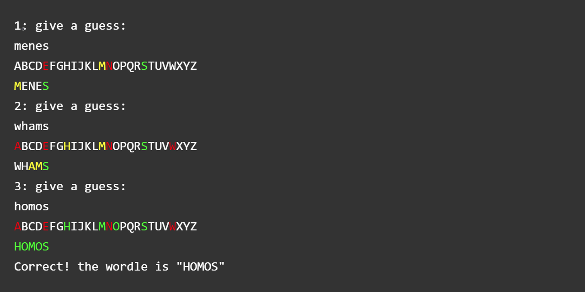

a python implementation of the famous WORDLE game

---

### how to use

+ play the wordle game in command line
```bash
python wordle.py
```


+ generate a random wordle 

```python
from wordle import Wordle

my_wordle = Wordle()

my_wordle.guess('xxxxx') # guess with a user defined answer

```